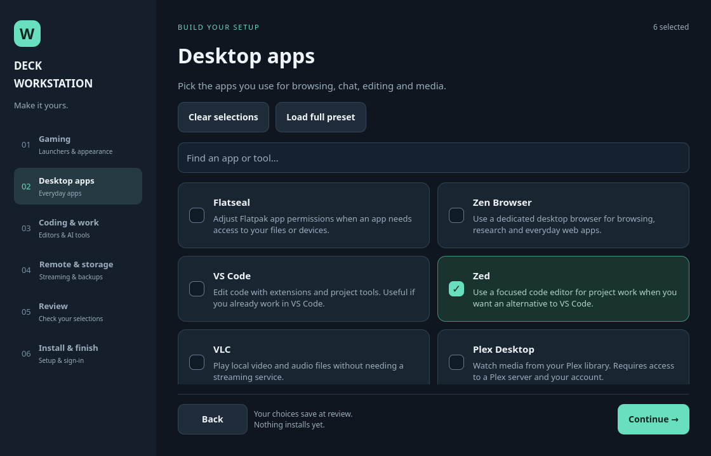
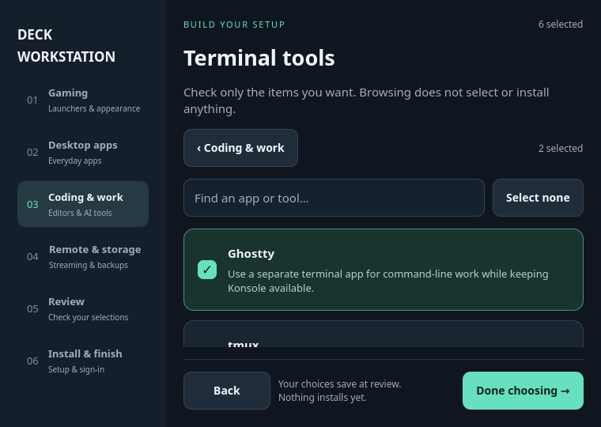

# v0.2.37 — Setup guidance and section flow

The sidebar follows Gaming → Desktop apps → Coding & work → Remote & storage → Review → Install & finish. Each section has a short explanation. Review edits return to the matching section.

Every curated option has a practical description explaining what it does, why to choose it, and relevant requirements. These include tools, desktop apps, launchers, Decky plugins and CSS Loader components. Descriptions also appear in review. Installer and theme policies are unchanged; presentation copy lives in config/setup-copy.json.

Native UI flow tests cover the reordered sections and review links at desktop, compact and minimum window sizes. Catalog coverage checks require an explanatory blurb for every curated option.

## More individual apps and terminal artwork

- Add Parsec, Telegram and WhatsApp (Whatsie, a clearly labeled third-party client).
- Keep Slack and Plex Desktop available as independent choices.
- Give the `ff` shell helper compact red Sharingan-inspired ASCII artwork when
  fastfetch is selected. Preserve personal Fastfetch settings.
- Verify independent app selection and repeat installation without extra downloads.

See [app management](APPS.md) and [terminal setup](../modules/terminal/README.md).

## Setup previews

