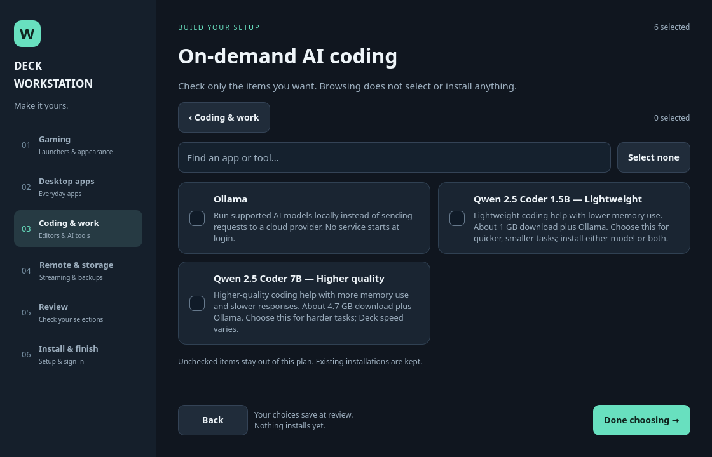

# v0.2.38 — Choose your local Qwen model

The installer offers independent **Lightweight (1.5B)** and **Higher quality (7B)**
Qwen 2.5 Coder choices. Select either or both. Each includes Ollama as a dependency.
Descriptions show approximate download sizes and the memory/speed tradeoff.

Only selected, missing or incomplete models are pulled. Existing setups retain
their lightweight default. OpenCode knows both models, and the workspace
`--model` option chooses which installed model to use. A 7B-only selection works
with the ordinary `deckctl ai-workspace open` command.

Owned-server cleanup and `OLLAMA_KEEP_ALIVE=0` are unchanged. Tests cover both
downloads, repeat-install skipping, partial readiness, default and explicit
launch choices, config migration and legacy defaults. Real model inference
performance has not been benchmarked.

See [AI workspace instructions](../modules/ai-workspace/README.md).

## Storage and smart updates

Before downloads, the installer checks the actual destination filesystem,
including model directories moved to another drive. It combines costs on the
same drive and includes 1 GiB of free-space headroom per drive. Conservative
budgets are 1.5 GiB for the light model, 6 GiB for the larger model, 8 GiB for
Ollama runtime staging and 256 MiB for its executable. A fresh installation
of both on one drive requires 16.75 GiB free. Complete, unchanged models do
not consume another download budget. Insufficient space stops the operation
with available, required and additional space figures; no automatic deletion
is performed. Space can still change while other programs write to the disk.

Installed Qwen tags are compared with upstream manifest metadata; only changed
or incomplete models are pulled. Ollama compares numbered release versions,
skips the same/older release and stages a newer runtime before switching.
If an update check is offline, a working installed version is retained with a
warning; this does not claim it is current. Model files and previous runtime
payloads remain available on disk. Read-only status does not check the network.
