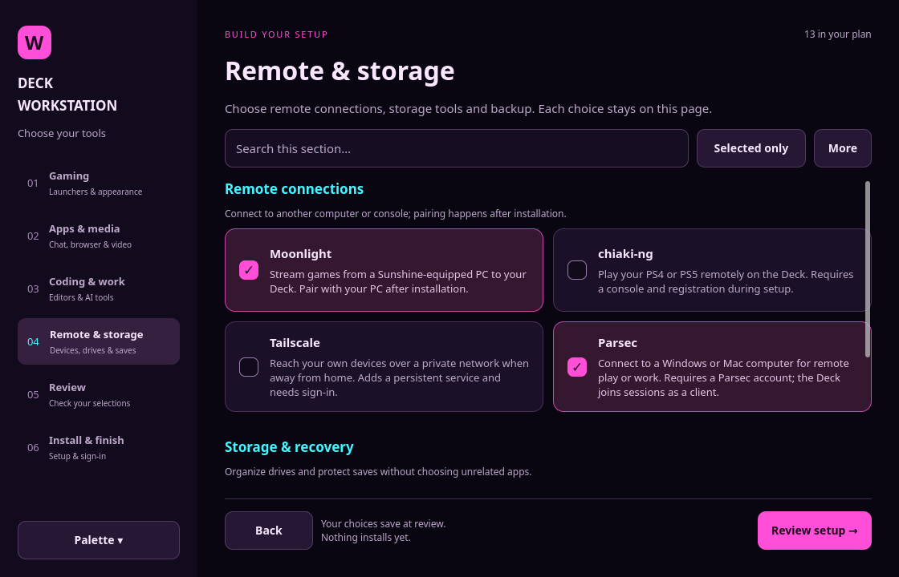
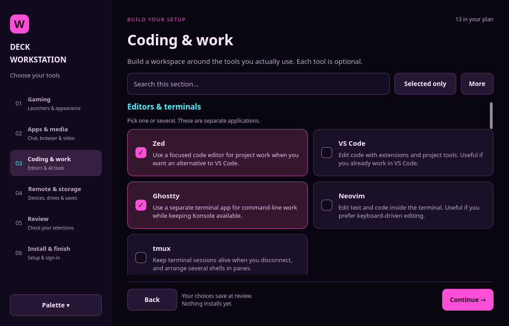
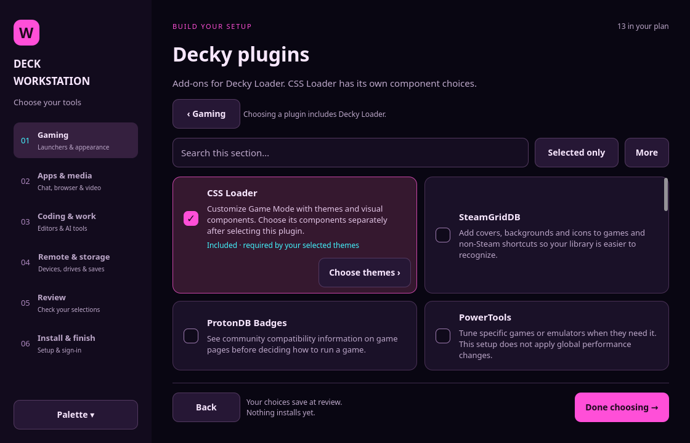

# v0.2.39 — Bubble Gum Rave setup, one choice at a time

The setup window uses dark plum surfaces, pink selections and cyan navigation
to match Bubble Gum Rave. Every optional app/tool download has an individual
checkbox in a named group. Category cards no longer redirect between sidebar
sections or conceal bundles.

- **Gaming:** individual launchers, Decky, controls, library tools, EmuDeck and Android.
- **Apps & media:** browser/utilities, chat, desktop media, streaming shortcuts and browser add-ons.
- **Coding & work:** editors, terminals, AI clients/models, shell tools, Docker/Distrobox and work web apps.
- **Remote & storage:** Moonlight, chiaki-ng, Tailscale, Parsec, storage and backup.

The sidebar palette selector offers Bubble Gum Rave, Midnight Ocean and Graphite.
It remembers the setup window colors separately from the installation plan.

Decky plugins and CSS Loader themes retain nested selectors. Browsing is free of
side effects; choosing a child includes its required parent. Required OpenCode,
Ollama and shared Chrome dependencies are explained. Plan saving normalizes
required category owners even when no category checkbox was clicked.

Back returns to the actual originating view, including its search and scroll
position. Editing from Review returns to Review. Search is available on every
choice page, a Selected only filter helps audit the plan, and bulk preset/reset
actions live in a confirmation menu.

Docker & Compose is chosen before review and provisioned by the development
module. A saved yes/no is respected without a second opt-in; prerequisite,
engine-adoption and storage-repair safeguards remain. A failed account phase
retries account setup rather than reinstalling applications.

Claude Code is an independent AI coding choice with native user-space installation,
update checks, a disk-space preflight and separate sign-in verification.

Validated with real offscreen Qt flows at 1120×720, 800×600 and 760×540, plus
catalog uniqueness, dependency normalization and Docker-selection contracts.
No vendor software is installed by these tests.

