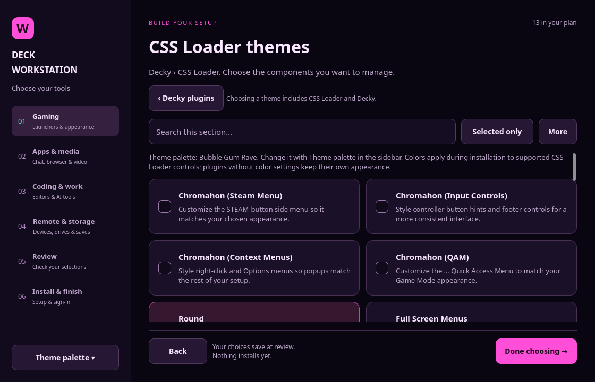
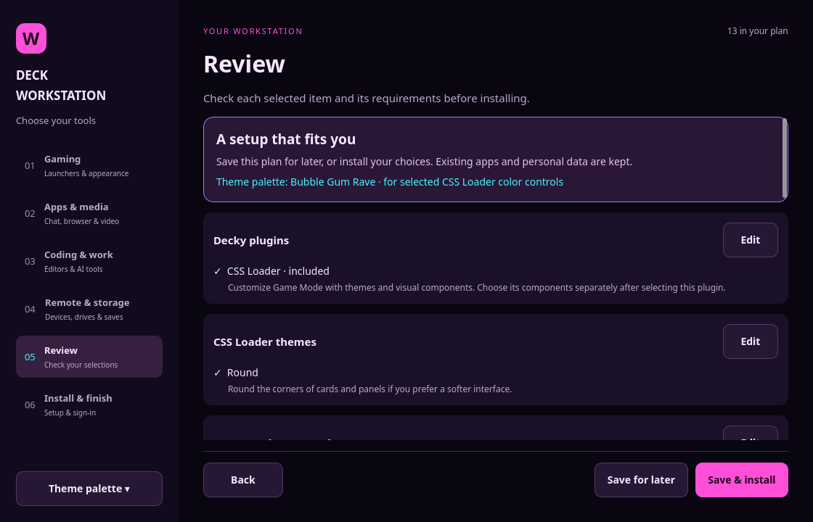
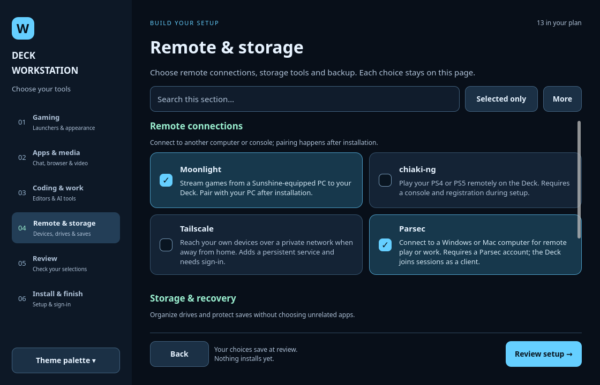
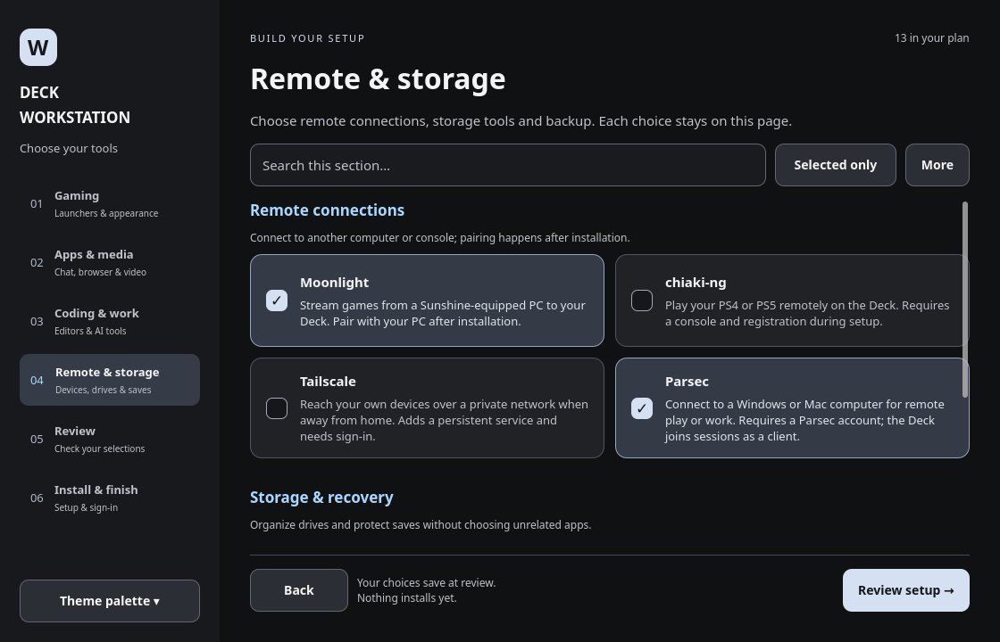

# v0.2.40 — Apply your palette to Decky themes

**Theme palette** now controls the colors installed through CSS Loader, as well
as the setup window preview. Choose Bubble Gum Rave, Midnight Ocean or Graphite
from the sidebar. Review shows the palette before you save or install.

The choice saves atomically with selected CSS components. CSS Loader applies it
through supported native color pickers and matching named presets, verifies the
actual saved colors, and captures a `<Palette name> - Base` recovery profile.
Changing palettes reuses installed themes; another application with the same
settings is a no-op. Existing profiles and unselected component settings remain.

Plugins without color controls retain their own appearance. This choice does not
install extra components or change terminal themes. Unsupported named-color
menus are reported explicitly instead of silently reverting to pink.

For an existing Deck: reopen `deckctl setup customize`, choose the palette, save
the plan, then run `deckctl decky css apply`. A normal installation applies it
during the CSS Loader setup stage. Portable profile exports include the palette
and CSS component list.

Validation includes the complete repository suite, real Qt flows at three window
sizes, and native backend contract tests covering saved colors, recovery profiles,
no duplicate downloads, preservation of unselected themes and profile roundtrips.
These tests do not install vendor software or claim physical Game Mode testing.

