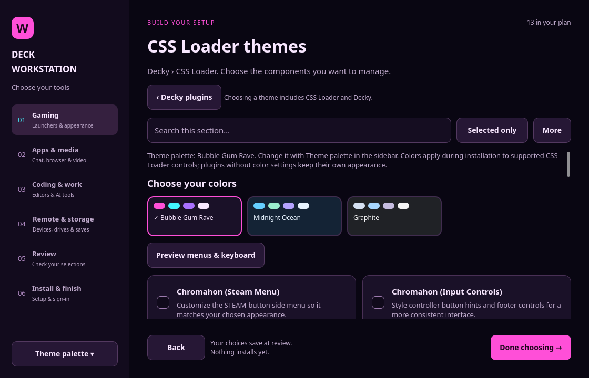

# v0.2.41 — Share choices and resume individual installs

Setup exports now carry every saved selection, including launchers, tools,
Decky plugins and CSS palettes. Import previews the payload before confirmation;
users can remove choices at Review before installing.

Review can check installed evidence, available updates and staging space.
Installation records each item separately and supports targeted retry and resume
across restarts. Shared dependencies appear once. Account, pairing and vendor
setup are exposed through finish-screen actions with explicit readiness labels.

CSS Loader choices include palette swatches, live menu/keyboard color studies and
a link to the upstream theme gallery. Illustrations are labelled; they do not
claim to be screenshots of the user's Game Mode.

See [sharing and resuming setup](setup/SHARING-AND-RESUME.md) for commands and the
limits of download estimates and account detection. Physical Deck acceptance is
separate from automated temporary-settings tests.

