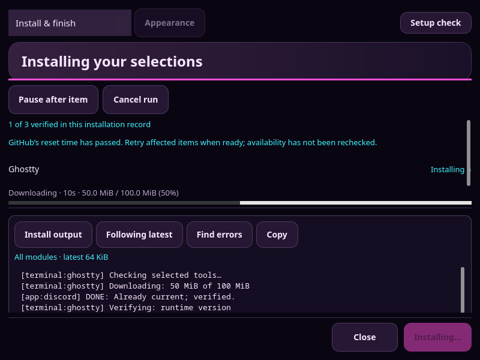
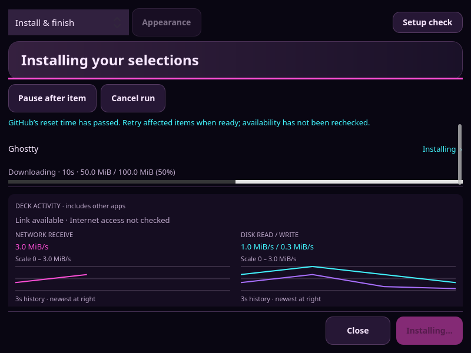
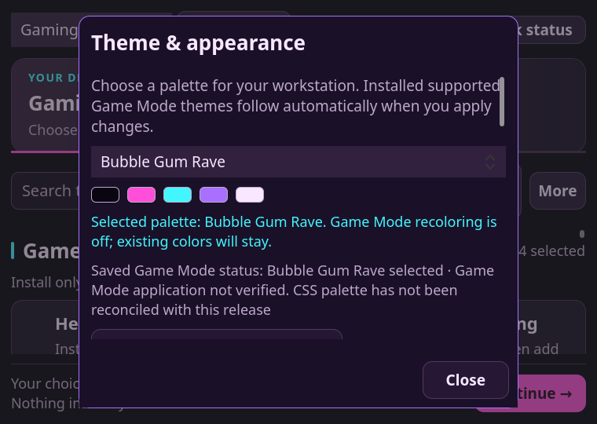
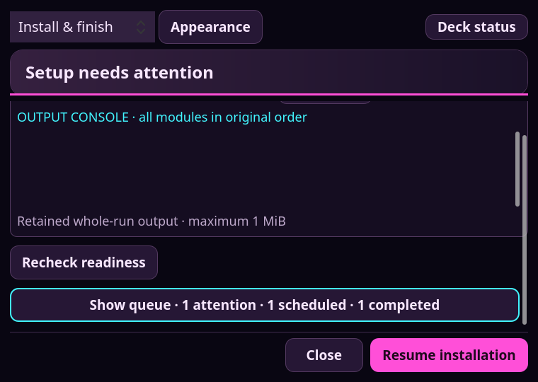
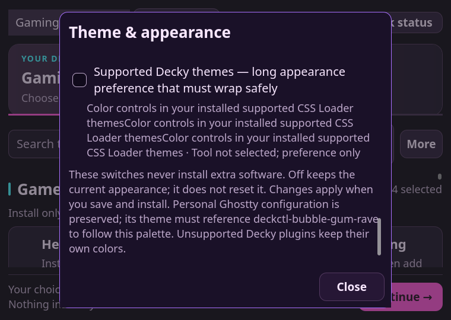
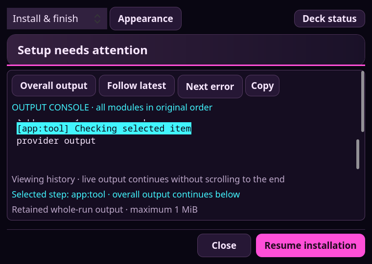
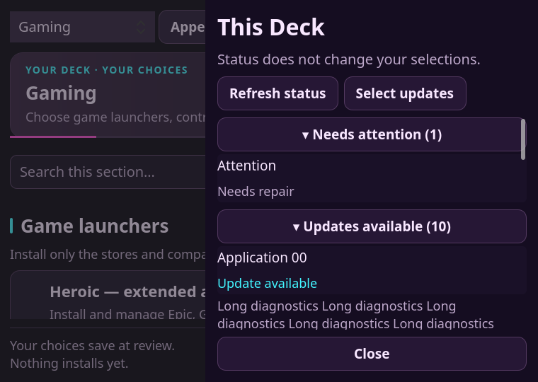
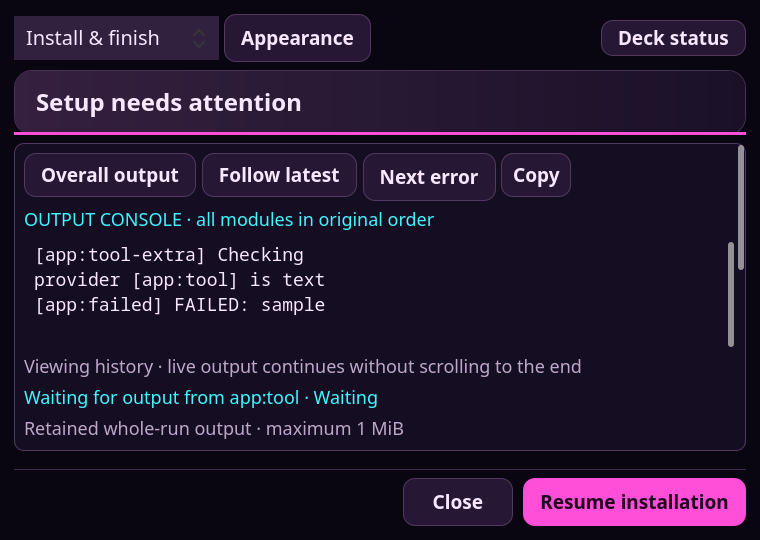
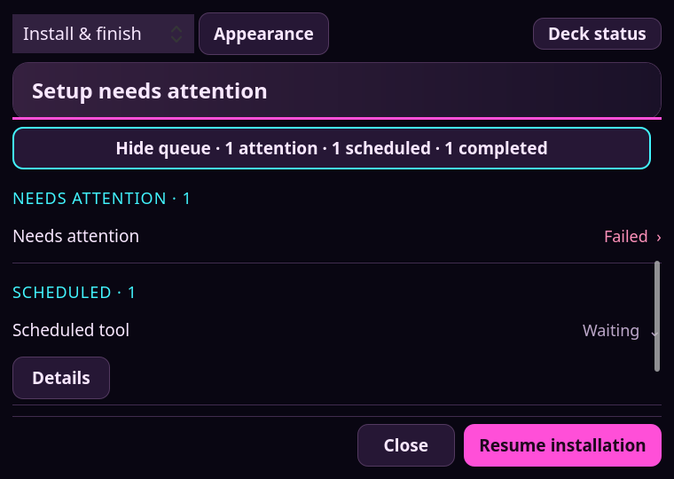
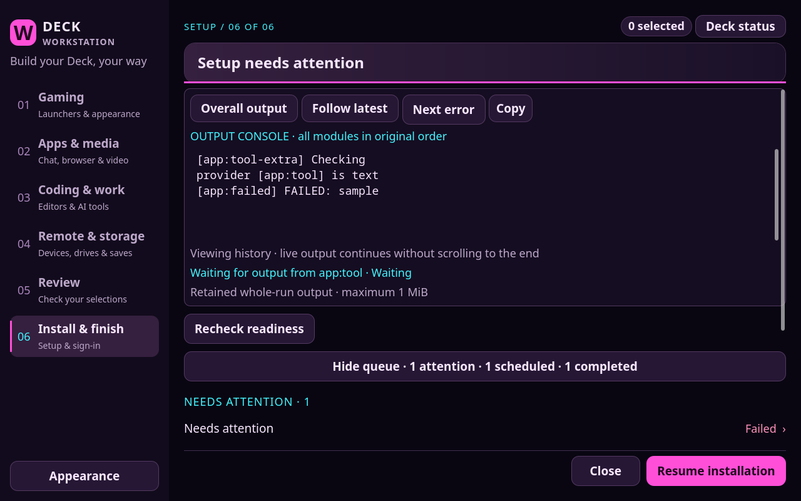

# Setup layout and continuous-output refinement

This pass retains the existing Qt/QML and Python architecture. Two independent,
read-only UI and test-coverage investigations preceded the changes; a separate
validation reviewer inspected the final diff. The earlier
[architecture decision](../../UI-INSTALLER-AUDIT.md) remains applicable: this work
addresses layout and interaction defects, not a measured need for a new framework.
No installer providers, authentication workflows, or user configuration were
replaced. No additional runtime dependencies or background services were added.

## Findings and changes

| Priority | Finding | Implementation |
| --- | --- | --- |
| P1 | Details replaced the overall record with an item log, stopped combined updates, and was absent for scheduled items without logs. | [Setup.qml](../../../lib/deckctl/ui/Setup.qml), `showLog`, `applyConsole`, `markerIndex`: Details jumps to an exact line-start item marker in one ordered record. Waiting items stay selected until output arrives. New output continues while the viewport stays in history. |
| P1 | The 64 KiB snapshot could hide the beginning of an otherwise retained whole-run log. | [setup_window.py](../../../lib/deckctl/setup_window.py), `Session.console`: read the current run's bounded live record, then the identical archived record. Paths derive from a validated run ID, reject symlinks, and never stitch item logs together. [setup_process.py](../../../lib/deckctl/setup_process.py) marks snapshot truncation. |
| P1 | Long dialog content and larger fonts could clip actions or overflow the scroll viewport. | Shared fitted/message dialogs, wrapped actions, dynamic checkbox/banner height, fixed dialog actions, explicit drawer insets, and actual scroll-viewport widths in [Setup.qml](../../../lib/deckctl/ui/Setup.qml). Focused controls scroll into view. |
| P2 | Scheduled/completed rows and logs competed with immediate activity evidence. | Deck Activity precedes Output Console. The queue starts collapsed with attention, scheduled, and completed counts. Active work and pause/cancel controls remain independent. Expansion and item details survive refresh/collapse. |
| P2 | Flat inventory order buried failures and repeated lengthy details. | `statusGroups` groups attention, updates, unknown/checking, installed, and optional missing tools; names sort alphabetically within groups. Details expand per item and retain state. Missing optional tools are neutral. Missing-password guidance takes priority; healthy system facts are below the groups. |
| P2 | Late console callbacks could overwrite newer selections; rotation could select unrelated text or leave the viewport blank. | Record/navigation checks preserve newer interaction. A new source or rotated record clears old offsets and resets the viewport. A recovered read clears its warning. Next error highlights within the full record rather than filtering it. |

The console remains a read-only diagnostic viewer. Explicit interactive vendor
and credential entry still use their existing labeled handoffs. Existing
redaction, private logging, retention, and cancellation ownership boundaries are
unchanged. A failed canonical read preserves the displayed record and reports the
failure. When only the live snapshot is available, or the retained head has been
removed, the UI explicitly describes the limit instead of claiming completeness.

## Rendered evidence

These are real offscreen Qt renders of synthetic fixtures, not live installs.
The long-text fixtures use **1.35× actual font metrics in the same logical window**,
not merely display DPI scaling. Normal UI text remains at its current scale;
`textScale` is a bounded presentation/testing property (1.0–1.35).

| Before | After |
| --- | --- |
|  |  |


Additional views below demonstrate different states, rather than before/after comparisons.

| Long content and status | Continuous output and queue |
| --- | --- |
|  |  |
|  |  |
|  |  |
| |  |



## Automated validation

Repository validation passed: **17 modules and 343 tests across 19 suites**.
Targeted backend contracts passed: **25 window tests** and **42 setup-experience
tests**. The focused Qt test passed at 1280×800 and 760×540 with 1.35× text,
long labels/paths, all setup stages, nested CSS/plugin pages, every dialog,
Appearance Tab/Shift+Tab traversal, modal focus restoration, pointer queue/Details
activation, stable status grouping, and continuous-output transitions. The
existing four-size rendered flow and real-keyboard test remain in the same
[test runner](../../../tests/integration/test_setup_ui.py). The focused fixture is
[setup_layout.qml](../../../tests/integration/setup_layout.qml).

The final combined Qt run passed **3 tests in 72.955 seconds**, including the
four-size flow and genuine keyboard test. The final focused confirmation passed
both sizes in **62.936 seconds**, including the corrected outer-console reveal,
visible highlight geometry, late error jump after record replacement, and
collapsed/expanded queue captures. Lint passed **82 Python files, 70 shell files,
and 5 workflows**, including documentation checks. Independent read-only review
identified no remaining blocking findings after these fixes. CI and any package
checks are recorded separately in the PR; local Qt does not prove every target
Qt version or physical input path. CI must retain the Qt 6.4 deferred TestCase gate;
a catalog-loaded property alone can start tests reentrantly on that Qt version.
Older-Qt focus tests also wait on actual visible bounds (at most one second),
rather than assuming a 30 ms delay proves scrolling completed. The predicate
only observes geometry; it does not move focus or scroll to make the test pass.
This specifically covers the Qt 6.4 CI failure with screenshot capture disabled.
Actions no longer derive their layout's maximum width from their parent's current
width, removing a geometry feedback dependency implicated by a Qt 6.4 polish-loop
warning. Explicit console navigation cancels a pending button-focus reveal.
Cross-version confirmation remains recorded in the PR.

A bounded near-cap stress fixture retains about 1,014,055 ASCII bytes, appends a
line, locates the last error, and sends real keyboard input. Its observed combined
apply/append/input time was 548–674 ms including intentional waits on this host.
A separate near-cap microbenchmark observed initial loads around 1.6–2.1 seconds;
results vary with concurrent work and fixture state. Append-only updates use
`TextArea.insert` without adding or changing newline bytes, avoiding unnecessary
whole-document replacement. These samples are not an FPS benchmark or a proven
performance improvement. A large initial log or replacement can remain noticeable;
no Rust component or framework migration is justified by this evidence.

## Physical acceptance still required

Run this checkout, rather than an older installed release:

```bash
cd /home/deck/Projects/steamdeck-install-controls
./bin/deckctl setup customize
```

Return this checklist with window size, SteamOS version, and any screenshot/log
for a failure. The checks below do not require installing additional tools unless
you intentionally select and start an installation.

- [ ] At 1280×800 and a smaller window, every dialog has a visible action footer.
- [ ] Appearance's last preference and explanatory text can be reached; Close remains visible.
- [ ] Steam Input controller mappings and Tab/Shift+Tab reach choices, long-list rows, and dialog actions without trapped focus.
- [ ] Deck Activity precedes output; pause/cancel stay usable during a real provider operation.
- [ ] A collapsed queue has correct counts; expanding it preserves the selected row across updates.
- [ ] Details on a scheduled item shows waiting context, then highlights its first real step without losing other output.
- [ ] Scrolling/selecting old output does not jump to the bottom on the next poll. Next error keeps surrounding output.
- [ ] A real failed/paused/resumed run retains its durable log and accurate item state.
- [ ] Status groups separate missing optional software from failures and retain expanded details after refresh.
- [ ] Long sessions, on-screen keyboard, touch, Steam Input, nested Desktop Mode, and actual network/storage changes remain usable.

Offscreen keyboard simulation does not prove raw controller mappings, touch,
on-screen-keyboard behavior, real provider throughput, or physical install/repair
outcomes. No live installation, password entry, or personal configuration was
performed to produce this report.
