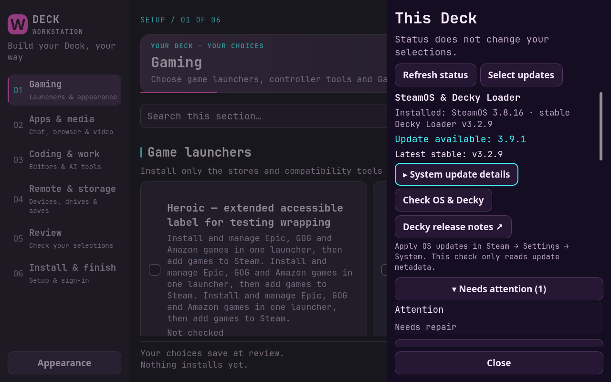
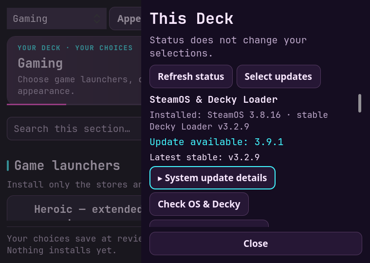

# SteamOS and Decky update availability

The Deck status drawer checks Valve's selected-channel SteamOS update metadata and the latest stable Decky Loader release on demand. It shows installed versions, available updates and provider failures. The requests are independent and run in a metadata worker. No updater CLI, sudo request, installation, restart or session switch is performed.

The requested compatibility assessment has been removed. There is no current-OS or offered-update compatibility result, no evidence database, no installed-tag release query and no automatic interpretation of release notes. A link to Decky release notes remains available.

## Rendered UI fixtures

Images use synthetic update data (3.9.1) and long-label/text-scale fixtures. They are not the live offered SteamOS version.

| 1280 × 800 | 760 × 540 |
| --- | --- |
|  |  |

Build/channel/check-time details start collapsed. Keyboard activation expands and collapses details; Close remains outside the scrollable content.

## Validation

Isolated contracts cover native/wrapped Valve responses, provider independence, rate-limit reset times, draft-release rejection, untrusted endpoints, redirects, oversized metadata, downgrade handling and nonblocking deduplication. A focused regression ensures the result has no compatibility fields and makes only one Loader request, to latest release metadata. Qt tests assert the compatibility controls are absent while update availability and details remain usable.

Physical acceptance: reopen Deck status, inspect installed/available versions, refresh online/offline and confirm ordinary installer controls remain usable. No real OS update is performed by these checks.
